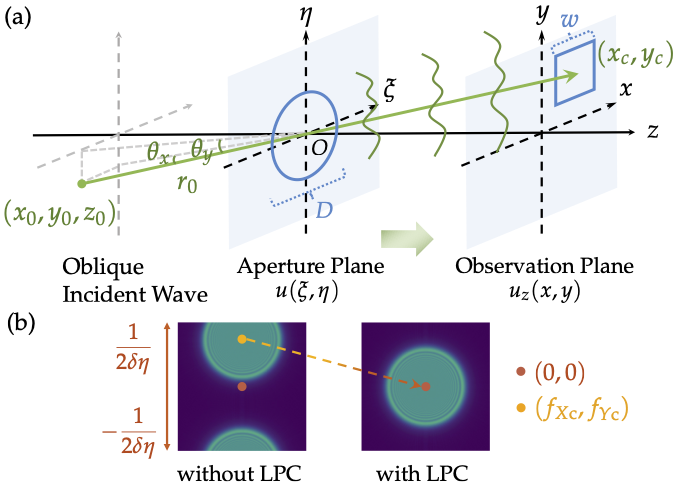
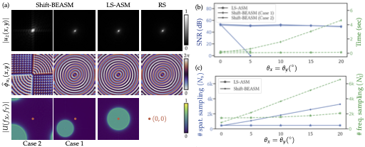
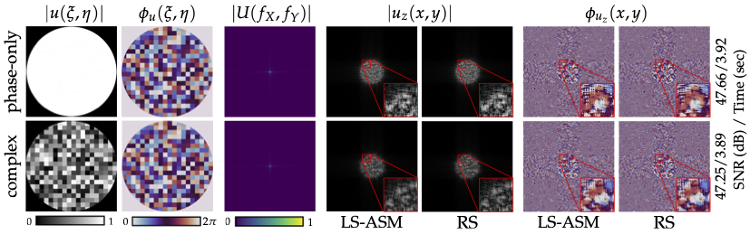

# LS-ASM
This repository provides the official open-source code of the following paper:

**Modeling off-axis diffraction with least-sampling angular spectrum method**\
Haoyu Wei*, Xin Liu*, Xiang Hao, Edmund Y. Lam, Yifan Peng\
Paper: https://doi.org/10.1364/OPTICA.490223 \
Correspondance: [Dr. Peng](https://www.eee.hku.hk/~evanpeng/) and [Prof. Lam](https://www.eee.hku.hk/~elam/). For implementation and experiment details contact Haoyu (haoyu.wei97@gmail.com).



## Quick start
This repository contains implementations of LS-ASM and Rayleigh-Sommerfeld algorithms, with spherical wave input and thin lens and diffuser modulations.

### Prerequisites
Create a conda environment from yml file:
```
conda env create -f environment.yml
```
If you are running on a GPU, please install a PyTorch version that matches the cuda version on your machine.

### Config and Run
Configurations are in `main.py`.\
Run and find results in the `results` folder.
```
python main.py
```

## Performance
We display LS-ASM speedup along 0 - 20 degrees of incident angles.\


Diffuser results closely resemble RS.\


## Citation

If you use this code and find our work valuable, please cite our paper.
```
@article{Wei:23,
title       = {Modeling Off-Axis Diffraction with the Least-Sampling Angular Spectrum Method},
author      = {Haoyu Wei and Xin Liu and Xiang Hao and Edmund Y. Lam and Yifan Peng},
journal     = {Optica},
volume      = {10}, number = {7}, pages = {959--962},
publisher   = {Optica Publishing Group},
year        = {2023}, 
month       = {Jul}, 
doi         = {10.1364/OPTICA.490223}
}
```